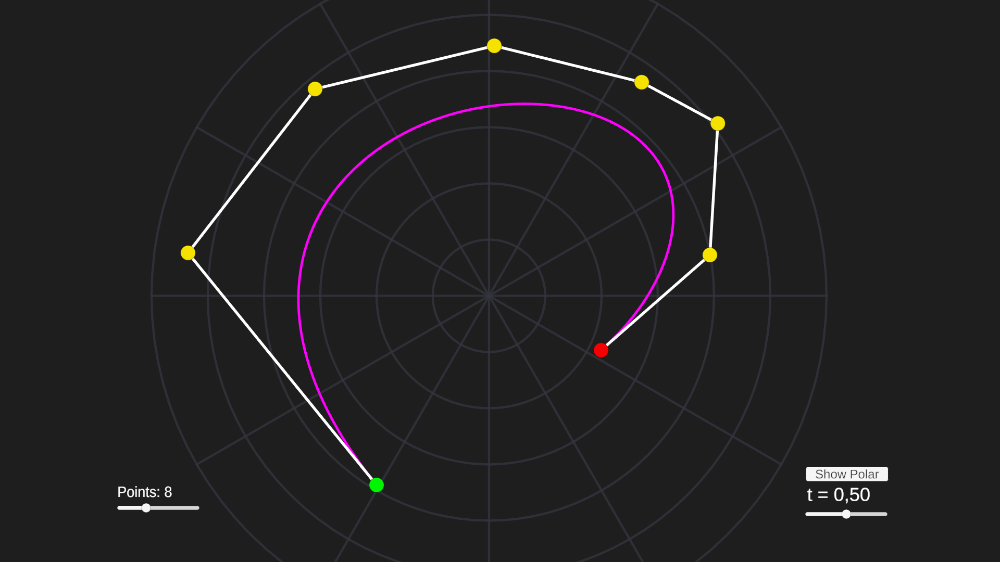
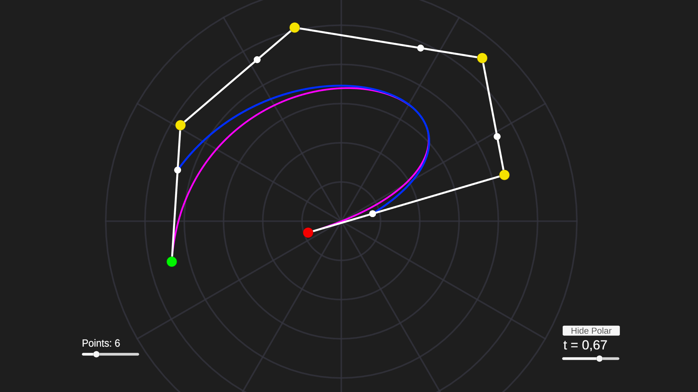

# Polar Bézier Curve Visualizer

  
  

  <i>Left: Bézier curve defined in polar coordinates.      Right: the polar curve of the Bézier.</i>

An interactive 2D Unity tool for designing, exploring, and analyzing Bézier curves defined in **polar coordinates**, including real-time **De Casteljau subdivision** and **polar curves of Bézier curves**.

This project blends **computer graphics**, **computational geometry**, and **projective geometry** into a real-time visual system.

An interactive 2D Unity tool for designing, exploring, and analyzing Bézier curves defined in **polar coordinates**, including real-time **De Casteljau subdivision** and **polar curves of Bézier curves**.

This project combines **computer graphics**, **computational geometry**, and **projective geometry** into an interactive curve laboratory.

---

## 1. What this project is

This tool allows you to:

- Define Bézier curves using **polar control points**
- Drag control points in real time
- Add and remove points dynamically
- Visualize the **control polygon**
- Evaluate Bézier curves using **De Casteljau’s algorithm**
- Construct **derived Bézier curves**
- Explore the **polar curve of a Bézier curve**

It behaves like a mini curve editor similar to vector graphics or CAD tools.

---

## 2. Polar Bézier curves

Instead of Cartesian control points (x, y), we use **polar coordinates**:

    Pi = (ri, θi)

Each control point is converted to world space by:

    xi = ri · cos(θi)
    yi = ri · sin(θi)

and then shifted by the origin O:

    Pi(world) = (xi, yi) + O

This allows:

- Easy rotation (change θ)
- Radial scaling (change r)
- Circular and spiral shapes
- Strong geometric symmetry

---

## 3. Bézier curve definition

A Bézier curve defined by control points P0 … Pn is:

    C(t) = Σ (from i = 0 to n) [ Bi,n(t) · Pi ]

where the Bernstein polynomials are:

    Bi,n(t) = (n choose i) · (1 − t)^(n − i) · t^i

Instead of computing this directly, we use the **De Casteljau algorithm**, which is numerically stable and geometric.

---

## 4. De Casteljau algorithm

Start with the control points:

    Pi(0) = Pi

Then recursively interpolate:

    Pi(k)(t) = (1 − t) · Pi(k−1) + t · P(i+1)(k−1)

After n levels:

    C(t) = P0(n)(t)

This gives the exact point on the Bézier curve.

---

## 5. First De Casteljau level — the derived Bézier curve

The first subdivision level is:

    Pi(1)(t) = (1 − t) · Pi + t · P(i+1)

These points form a **new Bézier curve of degree n−1**.

The project draws this curve in real time using the slider **t**.

This construction is the geometric foundation of:

- Subdivision
- Tangents
- Polar curves
- Projective duality

---

## 6. Polar of a Bézier curve

In projective geometry:

Given a Bézier curve C and a point Q, the **polar of Q with respect to C** is the set of all points on C whose tangent lines pass through Q.

For Bézier curves:

- If C has degree n
- The polar curve has degree n−1

Geometrically, this polar curve can be constructed from the first De Casteljau level.

---

## 7. Smart point insertion

When a new control point is added, the system:

1. Converts the control polygon to world space  
2. Finds the longest segment  
3. Inserts the new point at the midpoint  

This produces smooth refinement without deforming the curve shape.

---

## 8. FIFO removal of control points

When reducing the number of points, the system removes points in **FIFO order**:

> The first added point is the first removed.

This guarantees:

- Stable endpoints
- Predictable behavior
- No random curve collapse

---

## 9. Camera system

The viewport supports:

- Middle mouse / right mouse panning
- Mouse wheel zoom
- Smooth damping
- “Frame curve” (fit curve to view)

This makes the scene behave like a real curve editor.

---

## 10. Rendering system

The curve resolution adapts to screen size and curvature:

    segments = curve_pixel_length / pixels_per_segment

High-curvature regions automatically receive more segments for smoothness.

Sorting layers ensure the Bézier curve renders on top of the polar grid.

---

## 11. What this system is good for

This tool is ideal for:

- Studying Bézier geometry
- Teaching De Casteljau
- Exploring projective duality
- Procedural shape design
- Spline-based tools
- Mathematical visualization

---

## 12. Why polar coordinates

Polar Bézier curves allow:

- Natural circular motion
- Rotation by angle instead of matrix math
- Radial scaling
- Spiral and wave-like shapes
- Intuitive geometric control

They are especially powerful for:

- Radial UI
- Waves
- Orbits
- Rotating patterns

---

## 13. Summary

This project is not just a curve drawer.

It is a **geometric laboratory** for Bézier curves, polar coordinates, and projective geometry — implemented interactively in Unity.

You are not drawing lines.

You are exploring geometry.
